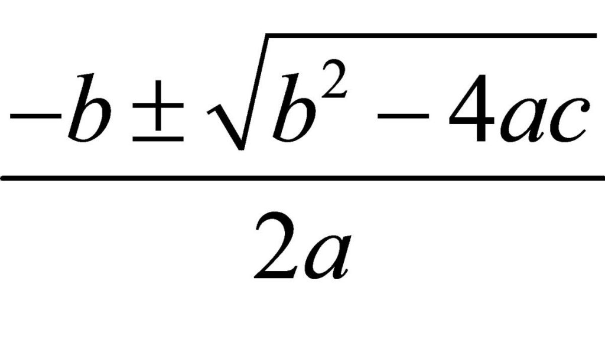

# Useful Java functions

<div style="text-align: right">
<a target="_blank" href="slides/view.html?fichero=04b"></a>
</div>

In this document we are going to learn some useful functions provided by Java core, that we can use in our programs.

## 1. Math functions

`Math` element from Java JDK provides a set of useful functions to do some mathematical operations. Here you can see some of the most useful ones:

* `Math.sqrt(n)` returns the square root of the parameter *n* provided. It returns a `double` value.
* `Math.pow(b, e)` returns the value of the first argument *b* raised to the power of the second argument *e*. It also returns a `double` value.
* `Math.abs(n)` returns the absolute value of the number *n*, in the same data type of *n*.
* `Math.log(n)` returns the natural logarithm (base e) of a double value.
* ...

You can check all the functions available in the [official documentation](https://docs.oracle.com/javase/8/docs/api/java/lang/Math.html) of this element.

!!! quote "Exercise 1"

    Create a program called **Equation.java** that tries to solve a 2nd degree equation ax^2 + bx + c = 0, given the values of *a*, *b* and *c*. Here you can see the general formula:

<div align="center">
    
</div>

## 2. Generating random numbers

Random numbers are really useful in some particular kind of programs, such as some simple games (lottery, bingo, board games...). We can generate them in Java in two different ways.

### 2.1. Using Math.random

We can use `Math.random()` function. It returns a random double value between 0 and 1 (1 is not included). So we can use it to just generate a double value in this range:

```java
double randomValue = Math.random();
```

If we want to generate a random number for a wider range, we can just multiply the result by this range, and even typecast the result. This code generates a random integer between 0 and 10 (excluding 10):

```java
int randomValue = (int)(Math.random() * 10);
```

Finally, if we want to move the range to another interval, we just need to sum or substract an initial value. This example generates a number between 20 and 30 (excluding 30):

```java
int randomValue = 20 + (int)(Math.random() * 10);
```

### 2.2. Using Random

Alternatively, we can use `Random` data type to generate random values. First of all, we need to import this class (`java.util.Random`). Then, we need to initialize a *Random* variable (this step must be done only ONCE in the program execution), and then we can generate as many random values as we need. To do this, we can use methods such as `nextInt` inside the random variable, defining the interval for the number to be generated.

This example generates a random number between 0 and 5 (5 is not included):

```java
import java.util.Random;
...
Random r = new Random();
int randomValue = r.nextInt(5);
```

This example generates a random integer between 10 and 20 (20 is not included):

```java
import java.util.Random;
...
Random r = new Random();
int randomValue = 10 + r.nextInt(10);
```

You can learn more about *Random* elementos in the [official API](https://docs.oracle.com/javase/8/docs/api/java/util/Random.html).

!!! quote "Exercise 2"

    Create a program called **NumberGuess.java** that generates a random number between 1 and 50 (both included) and give the user 5 attempts to guess the number. After each attempt, the program must inform the user if the secret number is greater or lower than the one specified by the user.