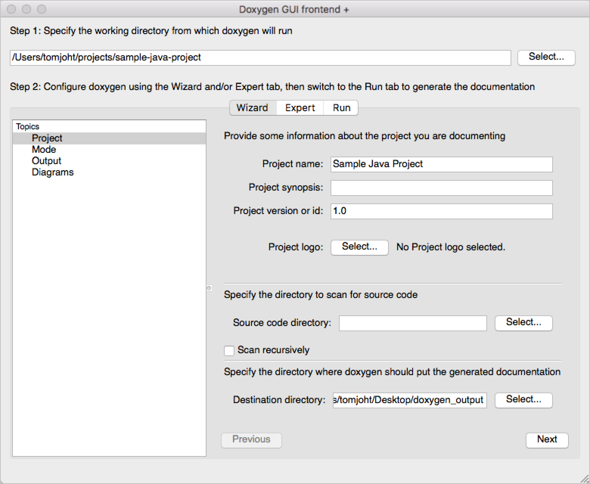
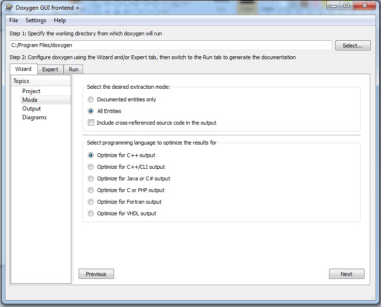
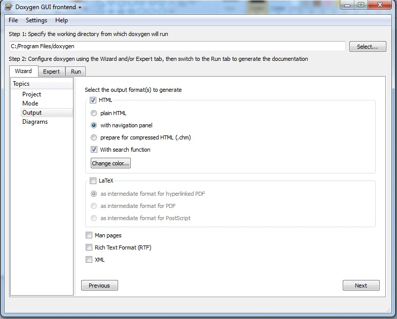
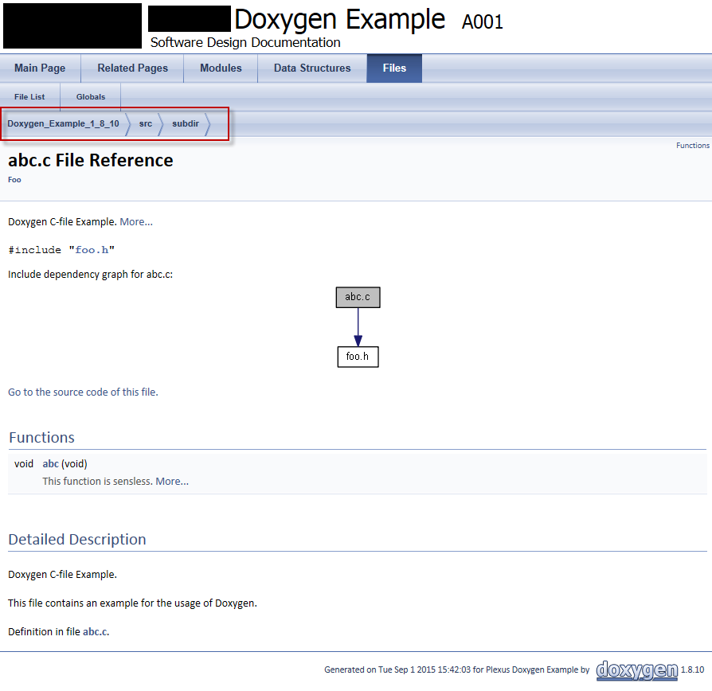

# Documentation with Doxygen

Doxygen is an external, independent tool that lets us generate documentation for many programming languages, such as C#, Java or PHP, among others. You can download Doxygen from its [official web site](http://www.doxygen.nl/), in the *Downloads* section. Regarding Windows, it consists in running an installer.

Then, we must launch the Doxygen wizard (also known as *DoxyWizard*), which will show an initial screen like this one:

    

In the upper text field we must choose the folder in which Doxygen has been installed (typically `C:\Program Files\doxygen`). In the lower text fields, we can just indicate the source folder to check the files (we can check the option to scan it recursively), and the destination folder to generate the documentation in.

    

We usually choose to include *All Entities*, and then the programming language that we are using (in our case, *Optimize for Java or C# output*). Then we move to next step.

    

Here we need to choose the output format. We usually check the HTML checkbox, and we can decide if we want to show a navigation panel or a search option. Then, we move to next step.

Last two steps consist in:

* Choosing if you want to generate class diagrams with the internal tool (or with a external tool called GraphViz)
* Run Doxygen

After running *Doxygen*, you will see the progress in the log text area, until a *Doxygen has finished* final message. Then, you can show the HTML output from Doxygen, or navigate to the chosen output folder.

    

!!! quote "Exercise 1"

    Generate the documentation for Exercise 1 and 2 of [this previous document](09a.md) using Doxygen
